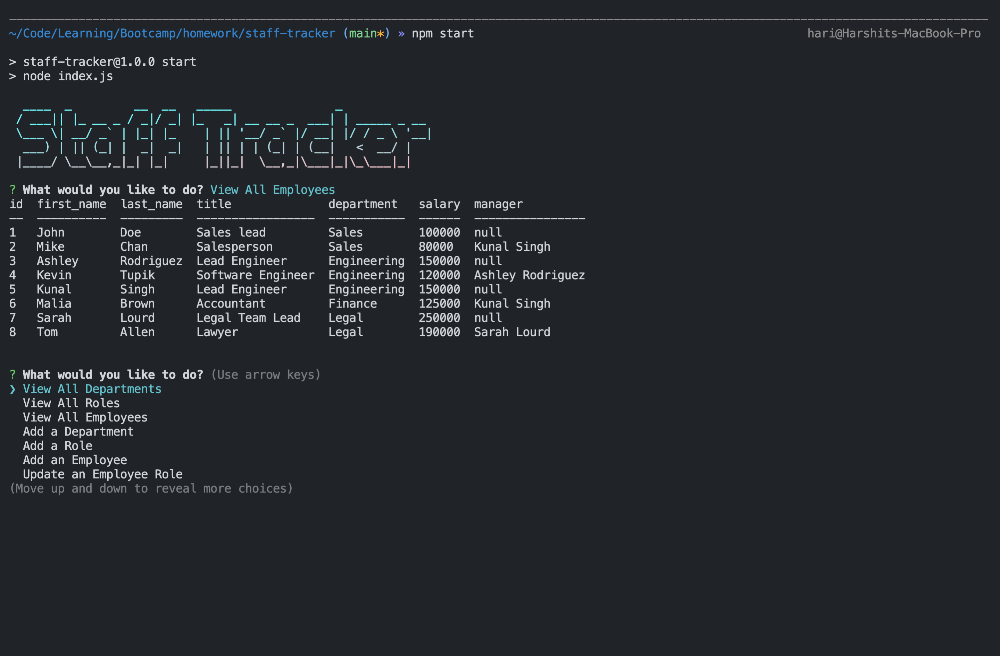

# Staff Tracker

Staff Tracker is a command line application built using Node.js, MySQL and Inquirer. This application helps track staff for a business by allowing the user to perform CRUD operations on departments, roles and employees.

This application implements the following node packages:

- Inquirer
- Mysql2
- Console.table
- Dotenv
- Figlet

## Table of Contents

- [Installation](#installation)
- [Usage](#usage)
- [License](#license)
- [Contributing](#contributing)
- [Tests](#tests)
- [Questions](#questions)

## Installation

To install this application,

1. Clone this repo on your local computer with Node.JS and MySQL installed
2. Open the directory and create a .env to store DB_NAME, DB_USER & DB_PASSWORD
3. Then run the application by typing `npm run` in the command line and follow the prompts

## Usage

This application is intended to be used for the following:

- To store and update information on employees, roles and budget
- Assign and update managers for employees
- Track department budget

Please refer to the demo below:

[Video Walkthrough](https://www.loom.com/share/9358eda797f941aaa3f772cbad30bca6)

## License

This project is covered under: **The Unlicense**

A license with no conditions whatsoever which dedicates works to the public domain. Unlicensed works, modifications, and larger works may be distributed under different terms and without source code.

For license details: [click here](https://choosealicense.com/licenses/unlicense/)

## Contributing

If you're interested in contributing to this project, please clone this repository, make improvements and open a pull request with explanation of the improvements.

## Tests

To test this application, please write the test file using your preferred testing framework and run `npm test` in your terminal.

## Questions

- This project is created and maintained by: [hari-ls](https://github.com/hari-ls)
- If you have addtional questions about this project, please feel free to reach out at: [hari@logicsync.com.au](mailto:hari@logicsync.com.au)
